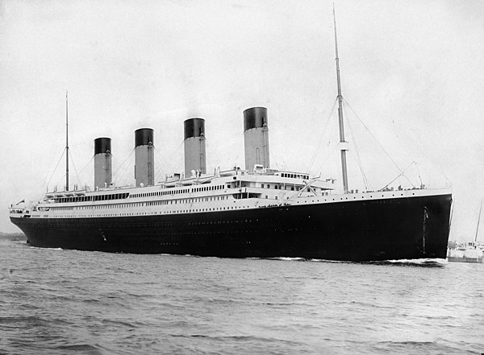

## Data Science - track activity

The Titanic sank in the early morning hours of 15 April 1912 in the North Atlantic Ocean. An estimated 2,224 people were on board when she struck an iceberg at around 23:40 on Sunday, 14 April 1912. Her sinking is one of the deadliest peacetime marine disasters in history.



Today you will be using a Titanic data set to find out how many people survived.

### Step 1️⃣ - Downloading the data set

Download the csv file for the activity here: [make.sc/titanic-dataset](make.sc/titanic-dataset)

### Step 2️⃣ - Setting up the project

Create a project in VSCode and add the csv file to it.

Create another file inside the project and save it as `titanic.py`

### Step 3️⃣ - Reading a CSV file

The first step will be making sure we can access the csv in our python file. We'll use a library for this. Add the following to `titanic.py`

```python
import csv
```

Now let's open the csv file:

```python
with open('titanic.csv') as csvfile:
```
Using `with` will make sure the file closes on its own when we are no longer using it.

Add this next:

```python
reader = csv.reader(csvfile, delimiter=',')
```

We now have the csv available in the `reader` variable. The delimiter specifies the character used to separate each field. In our case we use `,` You can open the csv file to confirm this.

### Step 4️⃣ - The first query

Let's find out how much data we have by counting how many entries the csv file contains.

Create a counter after `reader`

```python
counter = 0
```

We'll usean iterator to go over the entries of the file.

```python
for row in reader:
  #TODO: increase counter

#TODO:print out total
```

Run your code and identify:
**How many people do you have in the data set?** Confirm this number with people in your group.

### Step 5️⃣ - Accessing specific rows

Let's try printing out every passenger's name. We can do this by accessing specific rows in the csv.

Instead of increasing the counter, try printing out the name of each passenger. The name can be found in `row[3]` You can confirm this by looking at the first line in the csv which tell us the fields available (index starts at 0):

`PassengerId,Survived,Pclass,Name,Sex,Age,SibSp,Parch,Ticket,Fare,Cabin,Embarked`

So now add this inside the iterator:

```python
print(row[3])
```

Run your code and see the list of names.

### Step 6️⃣ - Query time

Now that you know how to handle the csv...

**a) Get the number of female passengers who survived.**

Pseudocode to use as guide

```python
#TODO: find the library that lets us work with CSVs and import it


with open('titanic.csv') as csvfile:
    #TODO: read the CSV into something we can iterate over and that delimits based on ','

    # TODO: set the counter

    #TODO: iterate over rows

        #TODO: if passenger is female and if she survived, increase the counter
        # NOTE: row[1] contains survival values, row[4] contains gender values
        # look over the CSV to see what to check against

#TODO: print the counter
```

**b) Get the number of passengers who survived whose age was below 18.**

Confirm that you got the right numbers with your group.
